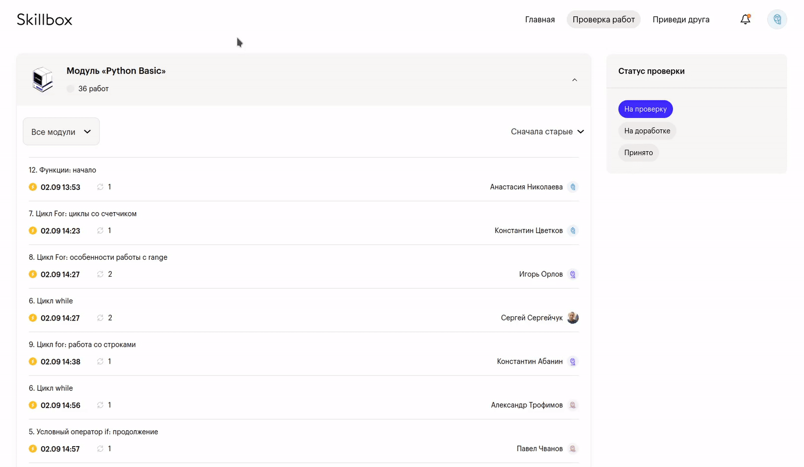
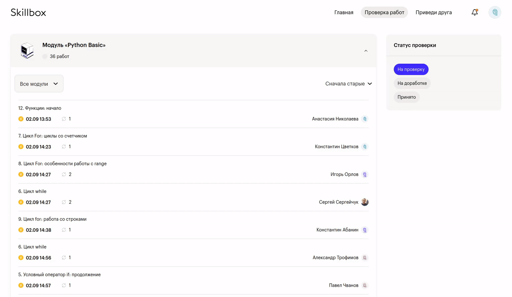
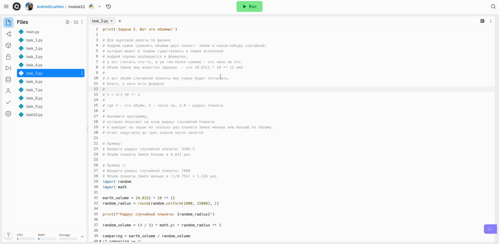

# Скрипты для проверяющих преподавателей Skillbox

- [Установка](#установка)
- [Прокачка LMS](#skillboximprover)
- [Прокачка Replit](#replitimprover)

## Установка
### Tampermonkey
Данное расширение браузера необходимо для работы скриптов. 

Инструкцию можно найти [на официальном сайте](https://www.tampermonkey.net/).

### Скрипты

1. Скопировать исходный код файлов:
   - [replit-improver.js](https://raw.githubusercontent.com/itookyourboo/skillbox_userscripts/master/replit-improver.js)
   - [skillbox-improver.js](https://raw.githubusercontent.com/itookyourboo/skillbox_userscripts/master/skillbox-improver.js)
2. Добавить их в Tampermonkey по отдельности, создав новый скрипт и вставив туда код.

## SkillboxImprover

Скрипт для прокачки LMS.

### VerdictShortcuts

Горячие клавиши для принятия и отклонения работы.

Автоматически закрывает окно, открытое в результате работы [OpenHomeworkLinkShortcuts](#openhomeworklinkshortcuts).

```javascript
// Принятие работы: Ctrl+Enter
const ACCEPT_SHORTCUT = "ctrl+return";
```


```javascript
// Отклонение работы: Ctrl+Shift+Enter
const DECLINE_SHORTCUT = "ctrl+shift+return";
```


### InputAutofocus

Автоматический фокус на поле ввода при переходе на страницу домашней работы.


### GoToTheFirstHomeworkShortcuts

Горячая клавиша для перехода на первую домашнюю работу в главном меню.

```javascript
// Ctrl+Right
const HOMEWORK_CARD_GO_SHORTCUT = "ctrl+right";
```



### HideEmptyCourses

Скрыть курсы без работ.

До: 


После:


### OpenHomeworkLinkShortcuts

Горячая клавиша для перехода по ссылке на работу.

```javascript
// Alt+L
const OPEN_LINK_SHORTCUT = "alt+l";
```


### ExpandCoursesShortcuts

Горячие клавиши для скрытия/раскрытия курсов.

```javascript
// Раскрыть предыдущий курс: Alt+Up
const EXPAND_PREVIOUS_SHORTCUT = "alt+up";
// Раскрыть следующий курс: Alt+Down
const EXPAND_NEXT_SHORTCUT = "alt+down";
```



## ReplitImprover

Скрипт для прокачки Replit.

### FileNavigationShortcuts

Горячие клавиши для перемещения между файлами.

```javascript
// Файл выше: Alt+Up
const FILE_UP_SHORTCUT = "alt+up";
// Файл ниже: Alt+Down
const FILE_DOWN_SHORTCUT = "alt+down";
```


Для перемещения по файлам внутри вложенной папки, потребуется ее раскрыть и нажать на первый находящийся в ней файл.

### HidePanelShortcuts

Горячие клавиши для скрытия/показа боковых панелей.

```javascript
// Панель файлов
const TOGGLE_PANEL_FILES_SHORTCUT = "h"
// Панель меню
const TOGGLE_PANEL_MENU_SHORTCUT = "m";
```


### AddCopyButton

Добавление кнопки Copy - скопировать весь код.


### CoverPageShortcuts

Горячие клавиши для перехода на страницу просмотра (на случай если вам кинули join-ссылку с возможностью редактирования).

```javascript
// Переход на Cover Page: Alt+C
const COVER_PAGE_SHORTCUT = "alt+c";
```


