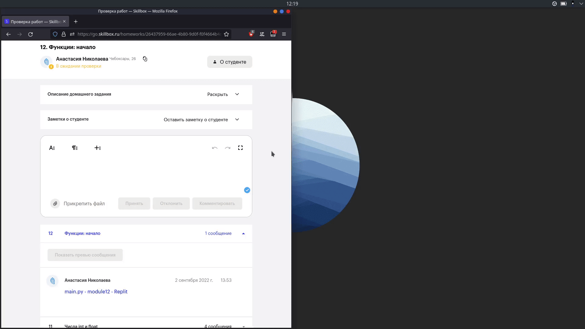
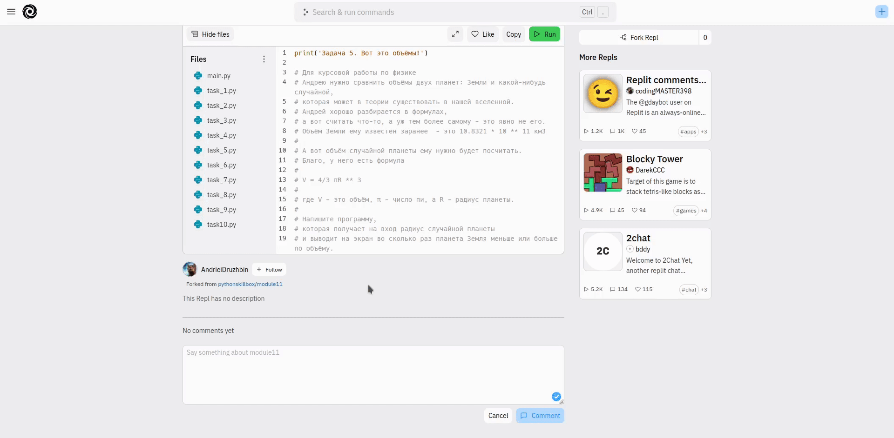

# Скрипты для проверяющих преподавателей Skillbox

- [Установка](#установка)
- [Прокачка LMS](#skillboximprover)
- [Прокачка Replit](#replitimprover)
- [Прокачка GitLab](#gitlabimprover)

## Установка
### Tampermonkey
Данное расширение браузера необходимо для работы скриптов. 

Инструкцию можно найти [на официальном сайте](https://www.tampermonkey.net/).

### Скрипты

1. Скопировать исходный код файлов:
   - [replit-improver.js](https://raw.githubusercontent.com/itookyourboo/skillbox_userscripts/master/replit-improver.js)
   - [skillbox-improver.js](https://raw.githubusercontent.com/itookyourboo/skillbox_userscripts/master/skillbox-improver.js)
   - [gitlab-improver.js](https://raw.githubusercontent.com/itookyourboo/skillbox_userscripts/master/gitlab-improver.js)
2. Добавить их в Tampermonkey по отдельности, создав новый скрипт и вставив туда код.

## SkillboxImprover

Скрипт для прокачки LMS.

### VerdictShortcuts

Горячие клавиши для принятия и отклонения работы.

Автоматически закрывает окно, открытое в результате работы [OpenHomeworkLinkShortcuts](#openhomeworklinkshortcuts).

```javascript
// Принятие работы: Ctrl+Enter
const ACCEPT_SHORTCUT = "ctrl+return";
```


```javascript
// Отклонение работы: Ctrl+Shift+Enter
const DECLINE_SHORTCUT = "ctrl+shift+return";
```


### InputAutofocus

Автоматический фокус на поле ввода при переходе на страницу домашней работы.


### GoToTheFirstHomeworkShortcuts

Горячая клавиша для перехода на первую домашнюю работу в главном меню.

```javascript
// Ctrl+Right
const HOMEWORK_CARD_GO_SHORTCUT = "ctrl+right";
```


### HideEmptyCourses

Скрыть курсы без работ.

До: 


После:


### OpenHomeworkLinkShortcuts

Горячая клавиша для перехода по ссылке на работу.

```javascript
// Alt+L
const OPEN_LINK_SHORTCUT = "alt+l";
```



### ExpandCoursesShortcuts

Горячие клавиши для скрытия/раскрытия курсов.

```javascript
// Раскрыть предыдущий курс: Alt+Up
const EXPAND_PREVIOUS_SHORTCUT = "alt+up";
// Раскрыть следующий курс: Alt+Down
const EXPAND_NEXT_SHORTCUT = "alt+down";
```


### SinglePage

Единая лента для всех домашних работ, отсортированных по времени их отправки.

Поддерживается комбинация Ctrl+ArrRight для быстрого перехода к первой работе.


### StatisticsSalary

Вывод в консоль сводной таблицы по проверкам с учетом ставки для отображения зарплаты.

При переходе на страницу со статистикой ее нужно перезагрузить.


Конфигурация курсов и ставок происходит в классе `StatisticsSalary`:

```javascript
const courses = {
   course: [
       {id: "76618f54-7c44-4ef5-83a0-cd1f1fd7ba7c", name: "Python Basic 1", cost: 0},
       {id: "68edfca7-fcb7-4934-a870-197b21ac338e", name: "Python Basic 2", cost: 0},
       {id: "45fd58aa-cb50-4db5-98d4-bcec538aa95f", name: "Python для Data Science", cost: 0},
       {id: "2e3a7d66-6c76-4acc-8aa9-5e33b658715f", name: "ДПО Python Basic", cost: 0},
       {id: "fa92a81c-a475-4119-8828-edbcca2f2588", name: "Python Advanced", cost: 0},
   ],
   diploma: [
       {id: "fdbd7d99-0d58-4370-8421-dda6c07a6b07", name: "Python Basic 1", cost: 0},
       {id: "f03f29ed-8e9f-4318-9f25-c2c3738700c1", name: "Python Basic 2", cost: 0},
       {id: "6734cb2e-813c-4fe0-9785-1349dac4d76b", name: "Python Basic 2 (2022)", cost: 0},
       {id: "63f99248-ebe7-46d9-a108-0416c21dcd06", name: "ДПО Python Basic", cost: 0},
       {id: "5c8085ac-52d2-406f-ab21-889dc1ee488b", name: "Python Advanced", cost: 0},
   ]
}
```

В `id` указывается ID курса, в `name` - его название для отображения в таблице, в `cost` - ставка за принятую работу.


## ReplitImprover

Скрипт для прокачки Replit.

### FileNavigationShortcuts

Горячие клавиши для перемещения между файлами.

```javascript
// Файл выше: Alt+Up
const FILE_UP_SHORTCUT = "alt+up";
// Файл ниже: Alt+Down
const FILE_DOWN_SHORTCUT = "alt+down";
```


Для перемещения по файлам внутри вложенной папки, потребуется ее раскрыть и нажать на первый находящийся в ней файл.

### HidePanelShortcuts

Горячие клавиши для скрытия/показа боковых панелей.

```javascript
// Панель файлов
const TOGGLE_PANEL_FILES_SHORTCUT = "h"
// Панель меню
const TOGGLE_PANEL_MENU_SHORTCUT = "m";
```


### AddCopyButton

Добавление кнопки Copy - скопировать весь код.



### CoverPageShortcuts

Горячие клавиши для перехода на страницу просмотра (на случай если вам кинули join-ссылку с возможностью редактирования).

```javascript
// Переход на Cover Page: Alt+C
const COVER_PAGE_SHORTCUT = "alt+c";
```


## GitLabImprover

Скрипт для прокачки GitLab

### DisableEmojis

Отключение окошка с эмоциями при написании двоеточия.

### MergeRequestShortcuts

#### MergeShortcut

Горячая клавиша для нажатия на кнопку Merge:

```javascript
const CLICK_MERGE_SHORTCUT = "alt+m"
```

#### SubmitReviewShortcut

Горячая клавиша для нажатия на кнопку Submit Review:

```javascript
const CLICK_SUBMIT_REVIEW = "alt+s";
```

#### OverviewShortcut

Горячая клавиша для перемещения в Overview:

```javascript
const CLICK_OVERVIEW_SHORTCUT = "alt+o";
```

#### ChangesShortcut

Горячая клавиша для перемещения в Changes:

```javascript
const CLICK_CHANGES_SHORTCUT = "alt+c";
```
